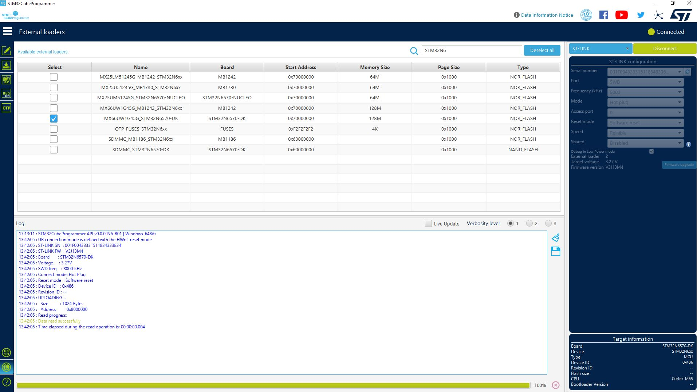
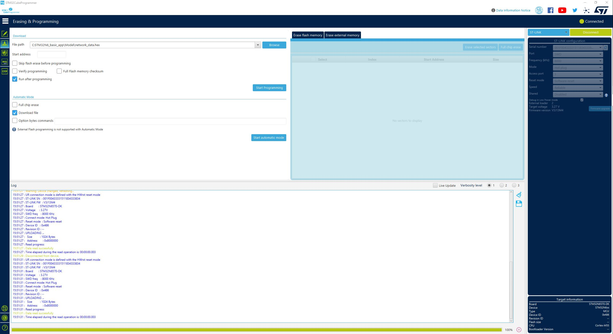

# How to Program Files

0. Ensure the board is in dev mode (boot switch in dev mode position).
1. Open STM32CubeProgrammer.
2. Select the Disco board through the "External loaders" tab.
3. ST-Link configuration: set mode to "Hot plug".
4. Connect the board.
5. From the "Erasing & programming" tab select the `FSBL/ai_fsbl.hex` file
6. Wait for flashing to complete.
7. From the "Erasing & programming" tab select the `Model/palm_detector_data.hex` file
8. Wait for flashing to complete.
9. From the "Erasing & programming" tab select the `Model/hand_landmark_data.hex` file
10. Wait for flashing to complete.
11. From the "Erasing & programming" tab select the `Binary/n6-ai-hand-landmarks-gesture-controller-signed.bin` file and enter `0x70100000` into the Start address field
12. Wait for flashing to complete.

